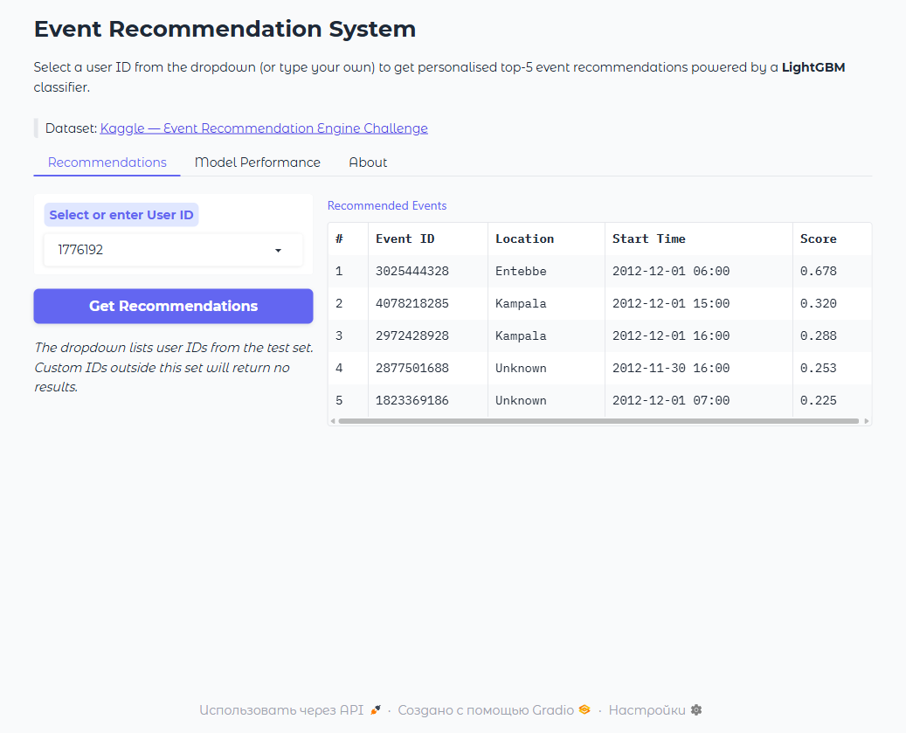
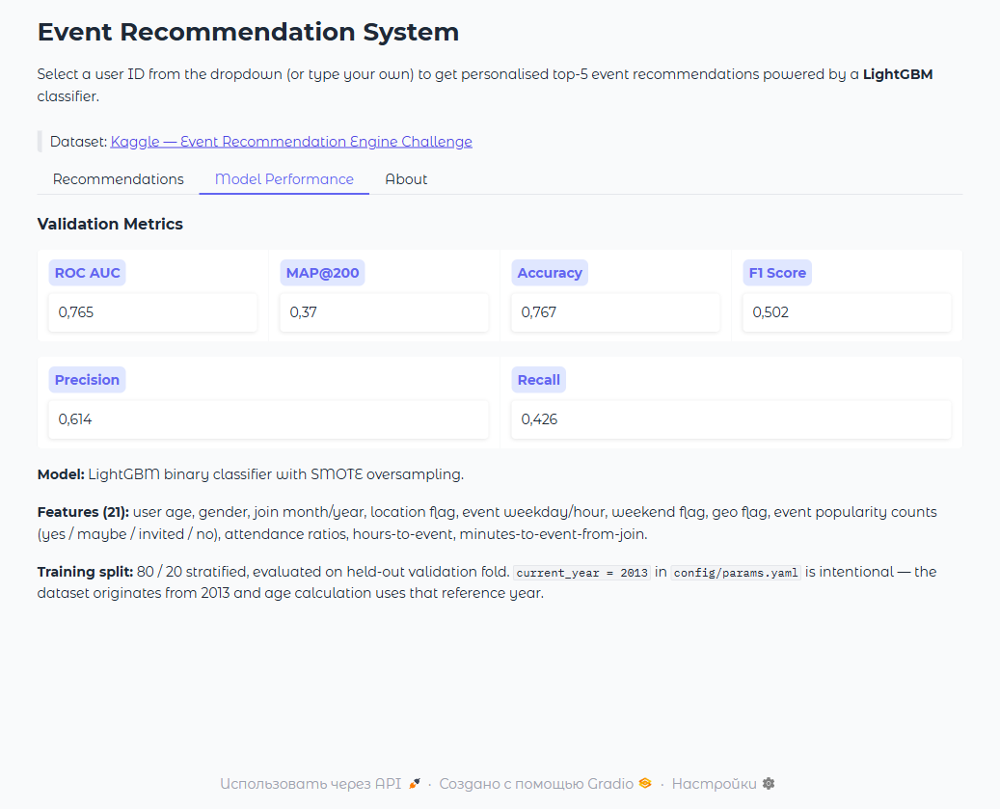

# Event Recommendation System

[](https://www.python.org/)
[](https://lightgbm.readthedocs.io/)
[](https://www.gradio.app/)
[](https://huggingface.co/spaces/DinoZawrik/Event)
[](LICENSE)
[](README.ru.md)

> An end-to-end event recommendation pipeline built for the [Kaggle Event Recommendation Engine Challenge](https://www.kaggle.com/c/event-recommendation-engine-challenge). A **LightGBM** classifier predicts user interest and ranks personalised event suggestions via an interactive **Gradio** interface.

**Live demo →** https://huggingface.co/spaces/DinoZawrik/Event

## Screenshots

| Recommendations | Model Performance |
|:---:|:---:|
|  |  |

---

## Key Features

| Feature | Details |
|---|---|
| Data pipeline | Pandas-based loading of users, events, attendees, train/test CSVs |
| Feature engineering | 21 features: temporal, geo, popularity counts, attendance ratios |
| Class imbalance | SMOTE oversampling (imbalanced-learn) |
| Model | LightGBM binary classifier |
| Evaluation | ROC AUC, MAP@200, Accuracy, F1 on validation split |
| Serving | Gradio 5 with tabbed UI, DataFrame output, live metrics dashboard |
| Containerisation | Docker + `docker-compose` ready |

---

## Model Performance

| Metric | Value |
|---|---|
| ROC AUC | **0.765** |
| MAP@200 | **0.370** |
| Accuracy | **76.7 %** |
| F1 Score | **0.502** |
| Precision | 0.614 |
| Recall | 0.426 |

---

## Project Structure

```
EventRecommendationSystem/
├── app.py                  # Gradio web application
├── main.py                 # CLI pipeline (train / predict / recommend)
├── config/
│   └── params.yaml         # All hyperparameters & paths
├── data/                   # Raw CSVs (not committed — see below)
├── models/                 # Saved LightGBM model
├── reports/
│   └── evaluation_metrics.json
├── src/
│   ├── data_loader.py
│   ├── feature_engineering.py
│   ├── model_training.py
│   ├── evaluate.py
│   ├── predict.py
│   ├── recommend.py
│   └── utils.py
├── notebooks/
│   └── event_recommendation_system.ipynb
├── requirements.txt
└── Dockerfile
```

---

## Quickstart

### 1. Clone & install

```bash
git clone https://github.com/<your-username>/EventRecommendationSystem.git
cd EventRecommendationSystem
pip install -r requirements.txt
```

### 2. Download data

Download the dataset from [Kaggle](https://www.kaggle.com/c/event-recommendation-engine-challenge/data)
and place the CSV files in `data/`:

```
data/
├── train.csv
├── test.csv
├── events.csv
├── users.csv
└── event_attendees.csv
```

### 3. Train the model

```bash
python main.py --mode train --config config/params.yaml
```

### 4. Launch the Gradio app

```bash
python app.py
```

Open http://localhost:7860 in your browser.

---

## Docker

```bash
docker build -t event-rec .
docker run -p 7860:7860 \
  -v $(pwd)/data:/app/data \
  -v $(pwd)/models:/app/models \
  event-rec
```

Or with Compose:

```bash
docker-compose up --build
```

---

## CLI Modes

```bash
# Train model & evaluate
python main.py --mode train

# Generate submission.csv for Kaggle
python main.py --mode predict

# Recommend top-N events for a specific user
python main.py --mode recommend --user_id 12345
```

---

## Configuration

All parameters live in [`config/params.yaml`](config/params.yaml).

Key settings:

| Key | Default | Description |
|---|---|---|
| `features.current_year` | `2013` | Reference year for age calculation (dataset is from 2013) |
| `features.age_outlier_threshold` | `100` | Age values above this are set to NaN |
| `recommend.top_n` | `5` | Number of recommendations to return |
| `output.model_dir` | `models/` | Directory for saved model artefacts |

---

## License

MIT — see [LICENSE](LICENSE).
