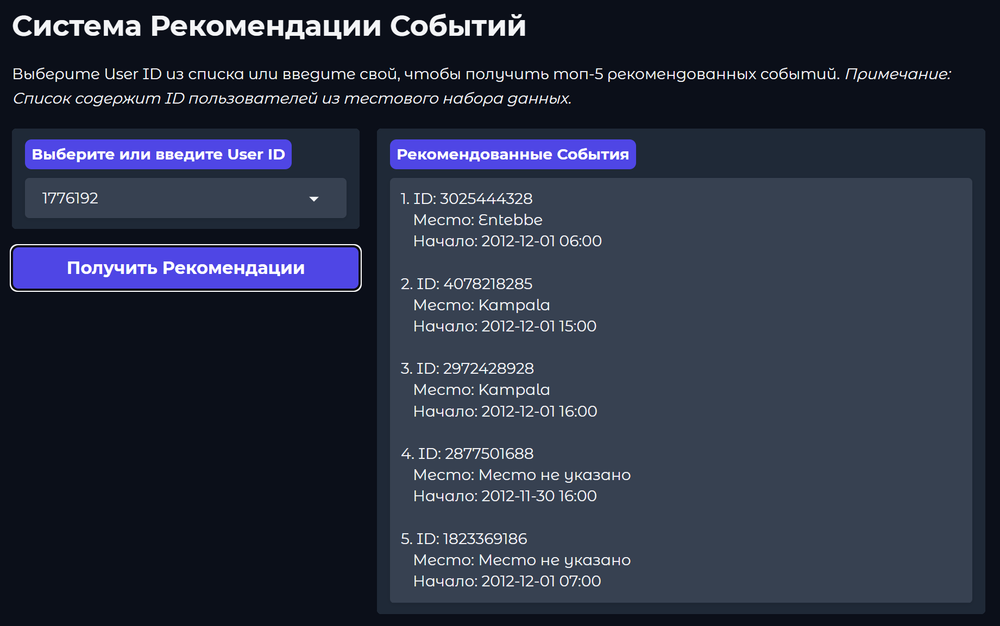

# Система Рекомендации Событий

Интерактивная система для рекомендации событий пользователям на основе их интересов и характеристик событий. Демонстрация модели развернута с использованием Gradio и доступна на Hugging Face Spaces.

## Описание

Этот проект реализует полный цикл Data Science для создания рекомендательной системы событий. Он включает загрузку и анализ данных, продвинутый feature engineering, обучение модели машинного обучения (LightGBM) для предсказания заинтересованности пользователя и развертывание интерактивного веб-интерфейса для демонстрации рекомендаций.

## Ключевые Возможности

*   **Обработка данных:** Загрузка, очистка и предобработка данных о пользователях, событиях и взаимодействиях.
*   **Feature Engineering:** Создание более 20 признаков, включая временные, признаки популярности, гео-признаки и обработку пропусков/аномалий.
*   **Моделирование:** Обучение и оценка модели LightGBM с использованием SMOTE для борьбы с дисбалансом классов.
*   **Оценка:** Расчет метрик AUC-ROC и MAP@k для оценки качества модели и ранжирования.
*   **Интерактивное Демо:** Веб-приложение на Gradio, размещенное на Hugging Face Spaces, для получения персональных рекомендаций.
*   **Генерация Submission:** Возможность создать файл `submission.csv` для соревнований (через `main.py`).

## Демонстрация на Hugging Face Spaces

**Попробуйте работающее приложение здесь:**

[](https://huggingface.co/spaces/DinoZawrik/Event)  

**Предпросмотр Интерфейса:**



## Структура Проекта

```
EventRecommend/  # Имя папки репозитория на HF Spaces
│
├── config/
│   └── params.yaml          # Конфигурация проекта
├── data/
│   ├── event_attendees.csv
│   ├── events_optimized.parquet # Оптимизированные данные событий <--- ВАЖНО
│   ├── preview.png          # Скриншот для README
│   ├── test.csv
│   └── users.csv
├── models/
│   └── lgbm_model.joblib    # Обученная модель
├── notebooks/
│   └── event_recommendation_system.ipynb # EDA и эксперименты
├── reports/                 # (Локально) Сюда сохраняются метрики и логи
├── src/                     # Исходный код модулей
│   ├── data_loader.py
│   ├── evaluate.py
│   ├── feature_engineering.py
│   ├── model_training.py
│   ├── predict.py
│   ├── recommend.py
│   └── utils.py
│
├── .gitattributes           # Конфигурация Git LFS
├── .gitignore               # Игнорируемые файлы для Git
├── app.py                   # Код Gradio приложения <--- ИСПОЛЬЗУЕТСЯ ДЛЯ ДЕПЛОЯ
├── main.py                  # Скрипт для локального обучения/предсказания
├── README.md                # Этот файл
└── requirements.txt         # Зависимости Python
```
*(Примечание: Некоторые файлы данных (`train.csv`, `user_friends.csv`, бенчмарки) были удалены из репозитория для соответствия лимитам хранилища HF Spaces)*

## Установка (Локально)

1.  **Клонируйте репозиторий:**
    ```bash
    # Сначала установите Git LFS: https://git-lfs.github.com/
    git lfs install
    git clone https://huggingface.co/spaces/DinoZawrik/Event
    cd Event
    ```
    *(Замените URL на URL вашего Space)*
2.  **Создайте и активируйте виртуальное окружение:**
    ```bash
    python -m venv event-env
    # Windows: event-env\Scripts\activate
    # macOS/Linux: source event-env/bin/activate
    ```
3.  **Установите зависимости:**
    ```bash
    pip install -r requirements.txt
    ```
4.  **Скачайте LFS файлы:** Git LFS должен автоматически скачать большие файлы при клонировании. Если нет, выполните:
    ```bash
    git lfs pull
    ```

## Использование (Локально)

### 1. Обучение модели

(Требует наличия `train.csv` и других файлов, которые могли быть удалены для деплоя. Используйте ваш исходный локальный репозиторий до очистки для этого шага).

```bash
python main.py --mode train
```
*   Сохраняет модель в `models/` и метрики в `reports/`.

### 2. Генерация файла предсказаний

```bash
python main.py --mode predict
```
*   Создает `submission.csv` в корне проекта.

### 3. Запуск локального Gradio демо

```bash
python app.py```
*   Запускает веб-сервер, доступный обычно по адресу `http://127.0.0.1:7860`.

## Методология

Система использует модель градиентного бустинга **LightGBM** для предсказания вероятности того, что пользователь заинтересуется событием. Основные шаги включают:

*   **Feature Engineering:** Создание признаков на основе времени, популярности событий (из `event_attendees.csv`), демографии пользователей и категорий событий (`c_1`...).
*   **Обработка данных:** Заполнение пропусков (например, медианой для возраста), One-Hot Encoding категорий.
*   **Борьба с дисбалансом:** Применение SMOTE на обучающей выборке (при запуске `main.py --mode train`).
*   **Оценка:** Использование AUC-ROC для бинарной классификации и MAP@k (Mean Average Precision at k, k=200) для оценки качества ранжирования рекомендаций.


## Технологии

*   Python
*   Pandas, NumPy
*   Scikit-learn
*   LightGBM
*   imbalanced-learn (SMOTE)
*   Gradio (Веб-интерфейс)
*   Hugging Face Spaces (Хостинг)
*   Git & Git LFS
